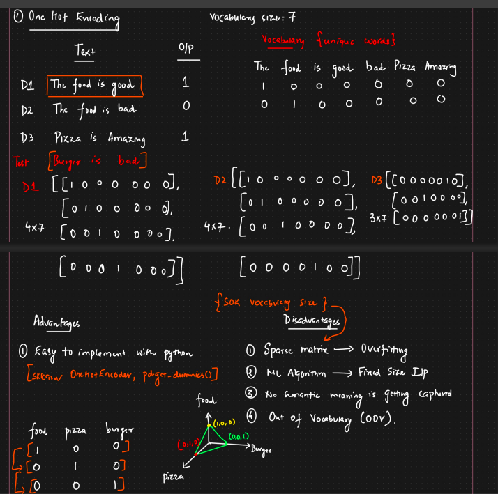
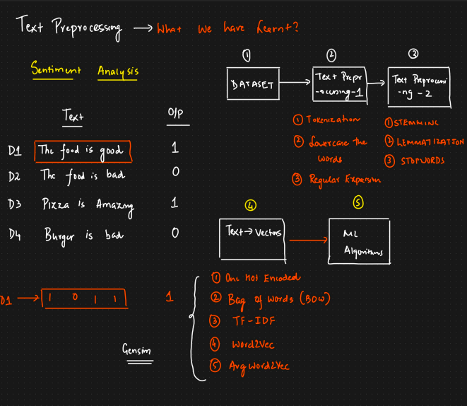

🧠 ***What Is One-Hot Encoding?***

In Natural Language Processing (NLP), One-Hot Encoding is a way to convert words into numbers/vectors, which machines can understand.

It turns each word into a vector of 0s and 1s:
The length of the vector = total number of unique words (vocabulary size)
The position of 1 = the index of the word in the vocabulary
All other positions = 0

🧾 **Simple Example 1**

OHE 
    TEXT                                        Vocublary Unique words 
 D1 The food is good                        The food is good bad amazing 
 D2 The food is bad                          1   0    0   0    0    0
 D3 Pizza is amazng                          0   1    0   0    0    0 

Vector Representation 

D1 [  [ 1 0 0 0 0 0 0  ] ,
      [ 0 1 0 0 0 0 0  ] ,
      [ 0 0 1 0 0 0 0  ] ,   
      [ 0 0 0 1 0 0 0  ] ,  
]

🧾 **Simple Exampl 2 e**
Let's say your sentence is:

sentence = "I love NLP"

**Step 1: Build Vocabulary**

Extract all unique words:

vocab = ["I", "love", "NLP"]

**Step 1: Build Vocabulary**

Extract all unique words:

"I"    → 0  
"love" → 1  
"NLP"  → 2

**Step 2: Convert Words to Vectors**

| Word   | One-Hot Vector |
| ------ | -------------- |
| "I"    | [1, 0, 0]     |
| "love" | [0, 1, 0]     |
| "NLP"  | [0, 0, 1]     |

Each word has only one 1 and the rest are 0.

from sklearn.preprocessing import OneHotEncoder
import numpy as np

# Sample data
words = [["I"], ["love"], ["NLP"]]

# Initialize encoder
encoder = OneHotEncoder(sparse=False)

# Fit and transform
one_hot = encoder.fit_transform(words)

# Show result
print("Vocabulary:", encoder.categories_)
print("One-hot encoded:\n", one_hot)

***Output:***

Vocabulary: [array(['I', 'NLP', 'love'], dtype=object)]
One-hot encoded:
 [[1. 0. 0.]
  [0. 0. 1.]
  [0. 1. 0.]]

        Advantages                                      Disadvantages   

1. Easy to implement with python                    1. Sparse Matrix   ---> Overfiting 
                                                    2. ML Algorithum   ---> Fixed Size I/P 
                                                    3. No semantic meaning is getting captured 
                                                    4. Out of vocublary (OOV)

⚠️ **Limitations of One-Hot Encoding**

No semantic meaning: "love" and "like" are just as different as "love" and "dog".

Large vocabulary = huge vectors: If you have 10,000 words, each word is a vector of size 10,000 with one 1.

Sparse representation: Mostly 0s — not efficient.

Text Preprocessing is important for every technique.

