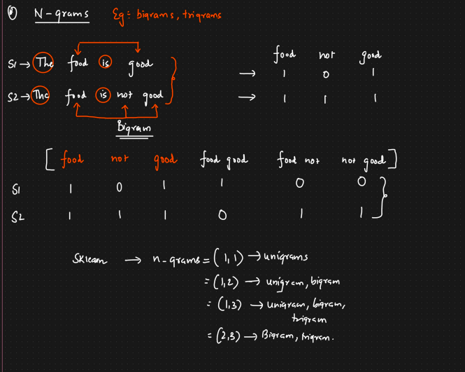
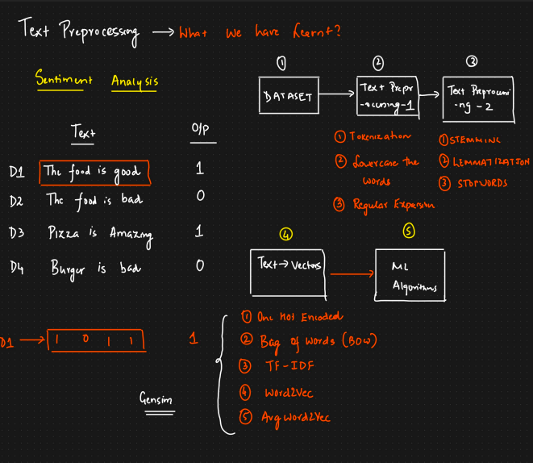

🧠 ***What is an N-gram?***

An N-gram is a contiguous sequence of N items (usually words or characters) from a given text.

    "N" refers to the number of words (or characters) in the sequence.

*********************************************************************
N-Gram 

s1. The food is good 

s2. The food is not good 

Vocublary 

    food not good

s1.  1   0    1
s2.  1   1    1

Bigram 

        Food  not  good  ------> food good   food not   not good 
s1        1    0   1                 1          0         0
s2        1    1   1                 0          1         1

sklearn ----> n-grams   = ( 1,1 ) ---> unigram 
                        = ( 1,2 ) ---> unigram, bigram  

 *********************************************************************

📌 ***Common types of N-grams (word-level):***

| N      | Name    | Example (for the sentence `"I love NLP"`) |
| ------ | ------- | ----------------------------------------- |
| 1-gram | Unigram | `["I", "love", "NLP"]`                    |
| 2-gram | Bigram  | `[("I", "love"), ("love", "NLP")]`        |
| 3-gram | Trigram | `[("I", "love", "NLP")]`                  |
| n-gram | N-gram  | Varies based on the value of N            |

🛠️ ***Why use N-grams?***

Capture context: A single word (unigram) lacks context. A bigram or trigram captures more meaning.

Useful in:

1. Text classification
2. Language modeling
3. Autocomplete/predictive typing
4. Machine translation

📌 ***How to generate N-grams in Python (using nltk)***

import nltk
from nltk.util import ngrams
from nltk.tokenize import word_tokenize

text = "I love learning NLP"
tokens = word_tokenize(text)

# Generate bigrams (n=2)
bigrams = list(ngrams(tokens, 2))
print(bigrams)

Output
[('I', 'love'), ('love', 'learning'), ('learning', 'NLP')]

⚙️ ***Using N-grams with CountVectorizer (scikit-learn):***

from sklearn.feature_extraction.text import CountVectorizer

text_data = ["I love NLP", "NLP is amazing"]
vectorizer = CountVectorizer(ngram_range=(1,2))  # unigrams + bigrams

X = vectorizer.fit_transform(text_data)
print(vectorizer.get_feature_names_out())

output 

['amazing' 'is' 'is amazing' 'love' 'love nlp' 'nlp' 'nlp is' 'i' 'i love']

✅ When to use which N?
Unigrams (n=1): Fast, simple, works okay in many basic tasks.

Bigrams (n=2): Adds context; useful for sentiment analysis, spam detection.

Trigrams (n=3): Better context, but sparser data and more computational cost.

Higher N: Rarely used alone, but helpful in advanced models like language generation.

Text Preprocessing is important for every technique.

