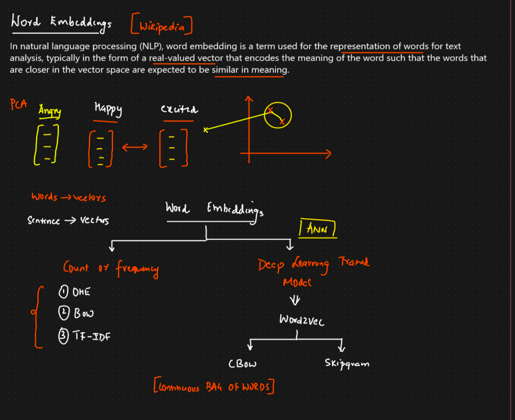

***Word Embedding***

🧠 What is a Word Embedding?
A word embedding is a technique to represent words as vectors (numbers) in a continuous vector space, capturing their meaning and relationships.

OR

In NLP, word embedding is a term used for the representation of word for text analysis, typically in the form of a real-valued vector that encodes the meaning of the word such that the words that are closed in the vector space are expected to be similar in meaning

Angry         Happy         Excited     
                                            Happy and excited are close in meaning so they will be close on the graph however angry is opposite to both the words it will be opposite on the graph 
[Vector]      [Vector]      [Vector]  

Instead of just knowing which words appear (like in Bag of Words or TF-IDF), word embeddings tell us how similar or related words are based on context.

🔢 Why Not Use One-Hot Encoding or TF-IDF?

| Method        | Issues                                                        |
| ------------- | ------------------------------------------------------------- |
| **One-Hot**   | Sparse vectors, no notion of similarity                       |
| **TF-IDF**    | Slight improvement but still doesn't capture meaning or order |
| **Embedding** | Dense, meaningful vectors based on word context               |

✅ Word Embedding Features:

1. Dense: Each word is represented in fewer dimensions (e.g., 50, 100, 300).
2. Context-aware: "King" and "Queen" will have similar vectors.
3. Captures semantics and syntactic patterns.

🗂️ Popular Word Embedding Techniques

| Technique     | Description                                                                |
| ------------- | -------------------------------------------------------------------------- |
| **Word2Vec**  | Trained using context windows. Two models: CBOW & Skip-Gram.               |
| **GloVe**     | Trained on global word co-occurrence statistics.                           |
| **FastText**  | Like Word2Vec, but uses character-level info (handles out-of-vocab words). |
| **BERT/ELMo** | Contextual embeddings (word meaning varies by sentence context).           |
