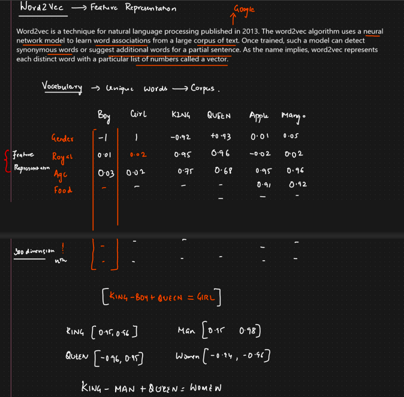
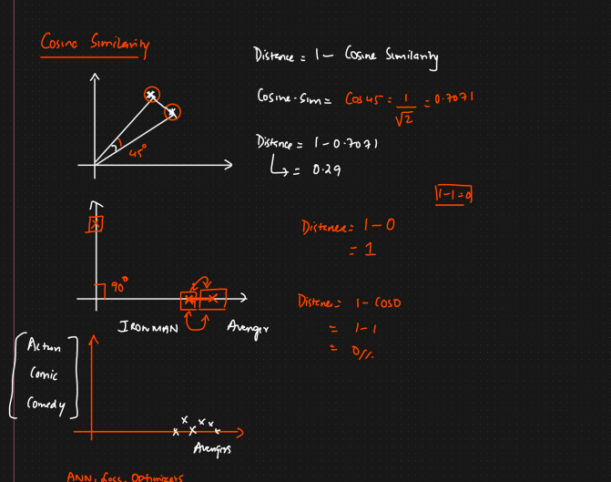

🧠 ***What is Word2Vec?***    -- Feature Representation 

Word2Vec is a deep learning technique developed by Google to represent words as dense vectors (word embeddings), where similar words are close in vector space.

Instead of representing words as simple numbers (like indexes or one-hot), Word2Vec learns meaningful patterns — like the relationships between words.

OR

Word2Vec is a technique for NLP processing published in 2013. The word2Vec algorithum uses a neural network model to learn word associations from a large corpus of text. Once trained, such a model can detect synnymous word or suggest additional words for a partial sentence. As the name immplies, word2vec represents each distinct word with a particular list of numbers called a vector. 

🧮 How It Works

Word2Vec is not a single model, but two architecture choices:

1. CBOW (Continuous Bag of Words)

Predicts a word based on its context.
Good when data is small.

**Example:**
Sentence: "I love machine learning"
To predict "machine", CBOW uses surrounding words like ["I", "love", "learning"].

2. Skip-Gram
Predicts the context words given a target word.

Better for large datasets and rare words.

Example:
Given "machine" → predict: "I", "love", "learning"

✨ Key Idea
Words used in similar contexts have similar meanings — Word2Vec captures this.

For example:

vector("king") - vector("man") + vector("woman") ≈ vector("queen")

This type of reasoning is only possible with embeddings like Word2Vec.

🔧 Using Word2Vec in Python (with Gensim)

Step 1: Install Gensim

pip install gensim

Step 2: Sample Code
from gensim.models import Word2Vec

# Example corpus (tokenized sentences)
sentences = [
    ["i", "love", "nlp"],
    ["nlp", "is", "fun"],
    ["deep", "learning", "is", "part", "of", "nlp"]
]

# Train the Word2Vec model
model = Word2Vec(sentences, vector_size=100, window=5, min_count=1, sg=0)  # sg=0 is CBOW, sg=1 is Skip-Gram

# Get the vector for a word
print(model.wv['nlp'])

# Find similar words
print(model.wv.most_similar('nlp'))

⚙️ Important Parameters

| Parameter     | Description                        |
| ------------- | ---------------------------------- |
| `vector_size` | Size of the output word vectors    |
| `window`      | Context window size (left + right) |
| `min_count`   | Ignores words with low frequency   |
| `sg`          | 0 = CBOW, 1 = Skip-Gram            |

