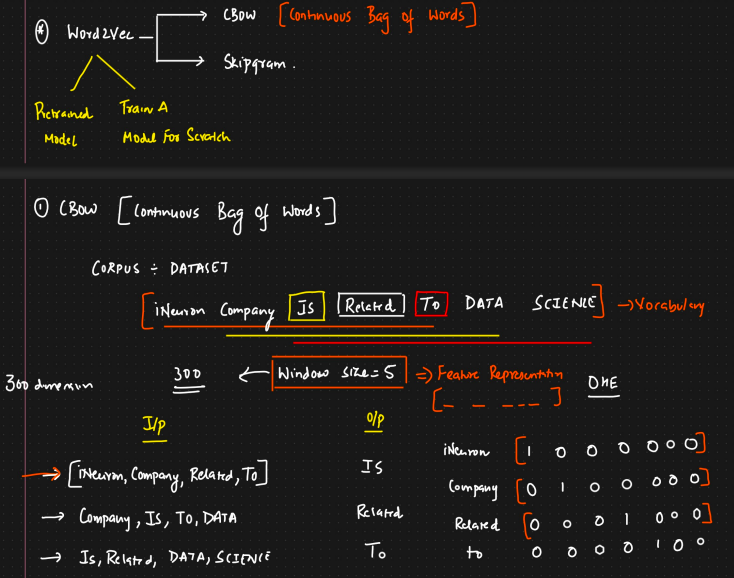
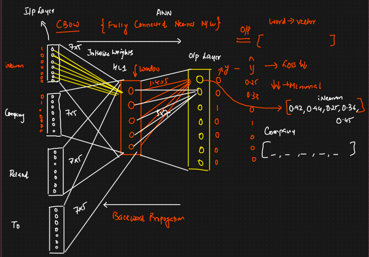

***The Core Idea of CBOW*** 🎯

The fundamental idea behind CBOW is to predict a target word based on its surrounding context words.

Imagine you have a sentence. CBOW takes a few words before and after a specific word (these are the "context words") and tries to predict that specific word (the "target word").

For example, in the sentence: "The quick brown fox jumps over the lazy dog."

If we want to predict the word "quick" (our target word), and we use a context window of 2 words before and 2 words after, the context words would be: "The", "brown", "fox". (Note: In practice, the exact handling of context words can vary slightly, e.g., taking n words before and n words after, or just n words in total from the surrounding window).

CBOW essentially asks: "Given these context words ['The', 'brown', 'fox'], what is the most probable target word?"

By training a neural network to do this prediction across a massive amount of text, the weights learned by the network's hidden layer become the word embeddings. Words with similar meanings or that appear in similar contexts will end up having similar vector representations.

Okay, let's dive into the Continuous Bag-of-Words (CBOW) model in Natural Language Processing (NLP).

CBOW is one of the two main architectures of the Word2Vec algorithm (the other being Skip-gram). Its primary purpose is to learn high-quality word embeddings (also known as word vectors). These embeddings represent words as dense numerical vectors in a way that captures their semantic relationships.

***The Core Idea of CBOW 🎯***

 

CBOW Model Architecture 🏗️

The CBOW model is typically a simple neural network with three layers:

Input Layer:

This layer takes the one-hot encoded vectors of the context words.
If your vocabulary size is V and your context window size is C (e.g., 2 words before and 2 words after makes C=4), then you'll have C input vectors, each of size V.
Example: If "The" is the 5th word in your vocabulary of 10,000 words, its one-hot vector is a vector of 10,000 zeros with a '1' at the 5th position.
Hidden Layer (Projection Layer):

This is a fully connected linear layer with N neurons, where N is the desired dimensionality of your word embeddings (e.g., 50, 100, 300).
The one-hot encoded context words are fed into this layer. The key operation here is that the vectors corresponding to the context words are typically averaged (or sometimes summed) before or after being multiplied by the input-to-hidden weight matrix 

 
This hidden layer activation h (a vector of size N) is essentially the averaged representation of the context.
The weights of this layer (the matrix W 
V×N
​
 ) are what we are interested in learning. After training, each row of this matrix corresponds to the word embedding for a word in the vocabulary.
Output Layer:

This layer is also fully connected and has V neurons (equal to the vocabulary size).
It takes the hidden layer representation h and tries to predict the target word.
It uses a second weight matrix, W 
N×V
′
​
 .
The output scores for each word in the vocabulary are calculated as: $$\text{scores} = W'_{N \times V}^T \cdot h$$
These scores are then typically passed through a softmax activation function to convert them into probabilities. The word with the highest probability is the model's prediction for the target word.
P(target word∣context words)=softmax(scores)

